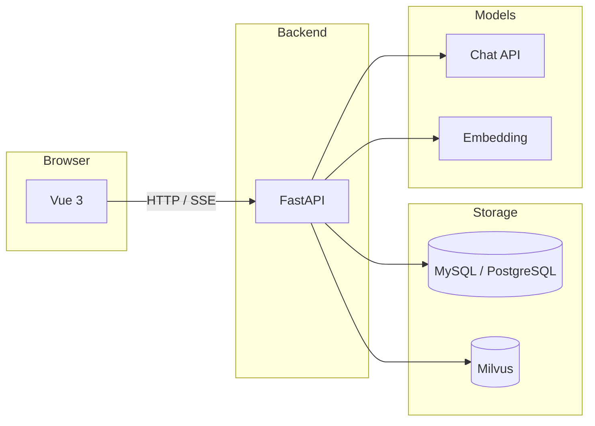

# OrgCopilot

[](LICENSE)
[](https://www.python.org/downloads/)
[](https://github.com/uglyp/org-copilot/actions/workflows/ci.yml)

**自托管的企业级知识库 RAG 与流式对话系统** — 数据与向量在本地或专有云，对话与检索可带 **引用溯源**；面向 **ToB / 政企** 场景强化 **权限（ACL）** 与可演进路线（**RAG → 可治理 Agent**）。

---

## 为什么选择 OrgCopilot

| 维度 | 说明 |
|------|------|
| **可追溯** | 回答可附带 **citations**，便于核对来源，降低「空口回答」风险。 |
| **权限与组织** | 文档级 **ACL**（分行、部门、密级等）与 Milvus 检索过滤、返回前二次校验；支持组织内知识库共享。 |
| **模型与部署** | Chat / Embedding 走 **OpenAI 兼容 HTTP**，便于国产、海外与 **私有化** 模型统一接入。 |
| **演进路线清晰** | 当前为 **线性 RAG 管道**；规划中将 **检索工具化**，并引入 **LangGraph**（检查点、人机在环、暂停恢复）。 |

---

## 功能一览

- **知识库**：PDF / 文本上传，解析、分块、向量化；可选 **图片 OCR**（`uv sync --extra image`）进入同一文本向量流水线。
- **对话**：多会话、**SSE** 流式输出、检索阶段展示、**引用列表**；多 chat 模型切换。
- **向量检索**：**Milvus**（默认 **Milvus Lite** 本地文件，可换独立服务）；**fastembed** 或远程 embedding。
- **账户与系统**：注册登录、JWT、忘记密码；管理员维护用户 / 组织 / ACL 字典等。

**未实现 / 规划中**（摘录）：双通道 CLIP 融合、对话内 VLM、完整审计流水与 SSO 等 — 以仓库代码为准。

---

## 目录

- [快速开始](#快速开始)
- [技术栈](#技术栈)
- [架构示意](#架构示意)
- [文档与路线图](#文档与路线图)
- [详细配置](#详细配置)
- [开源与协作](#开源与协作)

---

## 快速开始

环境：**[uv](https://docs.astral.sh/uv/)**、**Node.js（建议 LTS）**、**MySQL 或 PostgreSQL**（见 `backend/.env.example`）。

```bash
git clone https://github.com/uglyp/org-copilot.git
cd org-copilot
```

**终端 1 — 后端**

```bash
cd backend
uv sync
cp .env.example .env   # 配置 DATABASE_URL、FERNET_KEY、JWT_SECRET 等
uv run alembic upgrade head
uv run uvicorn app.main:app --reload --host 0.0.0.0 --port 8000
```

**终端 2 — 前端**

```bash
cd frontend
npm install
npm run dev
```

- 前端开发：<http://localhost:5173>（Vite 将 `/api` 代理到后端）
- 健康检查：<http://127.0.0.1:8000/health> · REST 前缀 **`/api/v1`**

Fork 后请将 `git clone` 地址换为你的仓库。若数据库仍使用旧库名 `kb_copilot`，只需在 `DATABASE_URL` 中保持即可。

---

## 技术栈

| 层级 | 技术 |
|------|------|
| 后端 | Python 3.11+、**FastAPI**、**SQLAlchemy 2**（async）、**Alembic** |
| 前端 | **Vue 3**、**Vite**、TypeScript、[vue-element-plus-x](https://element-plus-x.com) |
| 数据 | **MySQL** 或 **PostgreSQL**；**Milvus** / Milvus Lite |
| 模型 | OpenAI 兼容 Chat / Embeddings；本地 **fastembed**；可选 **Ollama** |

---

## 架构示意



---

## 详细配置

### 后端（`backend/`）

依赖以 **`pyproject.toml`** / **`uv.lock`** 为准。建库示例：

```sql
-- MySQL
CREATE DATABASE IF NOT EXISTS org_copilot CHARACTER SET utf8mb4 COLLATE utf8mb4_unicode_ci;
-- PostgreSQL
CREATE DATABASE org_copilot;
```

生产环境请关闭在响应中返回重置链接等调试行为（见 `.env.example` 中 `PASSWORD_RESET_TOKEN_IN_RESPONSE`）。

### 前端（`frontend/`）

- 默认 `baseURL`：`/api/v1`（见 `src/api/http.ts`）
- 静态部署无同源代理时设置 **`VITE_API_BASE`**（例如 `https://api.example.com/api/v1`）

### 向量与 RAG

- **本地向量**：`USE_LOCAL_EMBEDDING=true` + fastembed（默认 `BAAI/bge-small-zh-v1.5`）
- **远程向量**：在「模型设置」或 `.env` 中配置 OpenAI 兼容 **Embedding**
- **Milvus**：默认 Lite 本地 `.db`；生产可接独立 Milvus 服务（`.env` 中 `MILVUS_URI`）

### 图片 OCR

```bash
cd backend && uv sync --extra image
```

---

## 适合场景与边界

- **适合**：需要 **自托管** 知识库与 RAG、重视 **权限与引用** 的团队；金融 / 政务等多组织、多密级 **逻辑隔离** 原型。
- **边界**：不承诺开箱 **SSO**、完整 **审计流水**、商业级配额计费；生产环境请自行加固密钥、网络与数据库访问控制。

---

## 开源与协作

| 链接 | 说明 |
|------|------|
| [CONTRIBUTING.md](CONTRIBUTING.md) | 贡献方式与提交约定 |
| [SECURITY.md](SECURITY.md) | 安全披露 |
| [CODE_OF_CONDUCT.md](CODE_OF_CONDUCT.md) | 行为准则 |
| [LICENSE](LICENSE) | **MIT** |