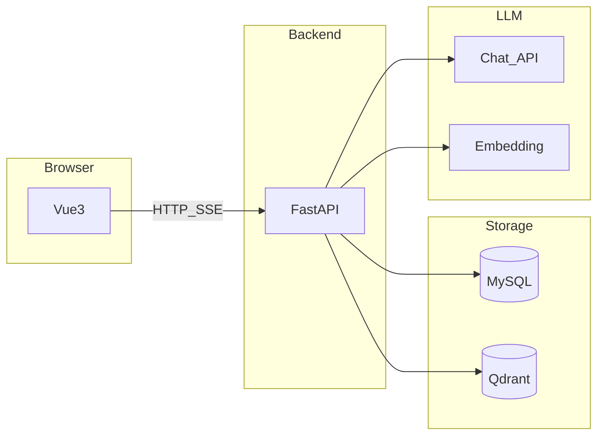

# KB-Copilot / 知识库 Copilot

[](LICENSE)
[](https://www.python.org/downloads/)
[](https://github.com/uglyp/KB-Copilot/actions/workflows/ci.yml)

自托管 **multimodal RAG** 知识库与流式对话：**FastAPI** + **Vue 3**，向量 **Qdrant**，支持 PDF/文本与图片 **OCR** 入库、**SSE** 回答与多模型提供商（**Ollama** / **DeepSeek** 等）。

**English:** Self-hosted **multimodal RAG** knowledge base with **SSE** chat. Ingest **PDF/text** and **images** (optional **PaddleOCR**), chunk & embed into **Qdrant**, **vector search**, stream answers. Stack: **FastAPI**, **Vue 3**, **MySQL**, **Alembic**; **fastembed** or **OpenAI-compatible** embeddings; chat via **DeepSeek**, **Ollama**, or compatible APIs.

**中文：** 面向自托管场景，持续迭代为更完整的企业级多模态能力。文档/PDF 与图片（可选 OCR）统一入库与检索；可选用本地 embedding 或远程 API；对话可切换本地与云端模型。

## 特性要点

| 维度 | 说明 |
| --- | --- |
| 部署 | 数据与向量可完全自建；Qdrant 默认嵌入式，亦可 Docker 部署（见下文「Docker 版 Qdrant」） |
| RAG | 分块、向量化、召回与对话编排；前端展示检索阶段（ThoughtChain 等） |
| 多模态 | 图片走 **PaddleOCR** 抽文本后与普通文档同流水线（可选依赖，见下文「知识库图片」） |
| 模型 | 多提供商、多 chat 模型；**Ollama** 与云端 API 可并存 |

## 技术栈

`FastAPI` · `Vue 3` · `Vite` · `TypeScript` · `MySQL` · `Alembic` · `Qdrant` · `fastembed` / OpenAI-compatible · `SSE` · [vue-element-plus-x](https://element-plus-x.com)

## 目录

- [最短快速开始](#最短快速开始)
- [截图占位](#截图)
- [架构概要](#架构概要)
- [Roadmap](#roadmap)
- [适合与当前边界](#适合与当前边界)
- [开源与协作](#开源与协作)
- [后端](#后端backend)
- [前端](#前端frontend)
- [向量与知识库（RAG）](#向量与知识库rag)
- [功能入口](#功能入口)

## 最短快速开始

前置：**[uv](https://docs.astral.sh/uv/)**、**MySQL**、**Node.js**。环境变量与排错见 [后端](#后端backend)、[前端](#前端frontend)；Ollama 详见 [`docs/LOCAL_DEV_AND_OLLAMA.md`](docs/LOCAL_DEV_AND_OLLAMA.md)。

**终端 1 — 后端**

```bash
git clone https://github.com/uglyp/KB-Copilot.git
cd KB-Copilot/backend
uv sync
cp .env.example .env   # 编辑 DATABASE_URL、FERNET_KEY、JWT_SECRET 等
uv run alembic upgrade head
uv run uvicorn app.main:app --reload --host 0.0.0.0 --port 8000
```

**终端 2 — 前端**（仓库根目录下）

```bash
cd KB-Copilot/frontend
npm install
npm run dev
```

- 前端默认 <http://localhost:5173>（Vite 代理 `/api` → 后端）
- 健康检查 <http://127.0.0.1:8000/health>，API 前缀 `/api/v1`

Fork 后请将 `git clone` 地址换成你的仓库 URL。

## 截图

将图片放入 [`docs/images/`](docs/images/) 后，取消下列注释即可在首页展示：

<!--


-->

## 架构概要



## Roadmap

| 状态 | 内容 |
| --- | --- |
| 已有 | 认证、知识库上传、PDF/文本/图片 OCR（可选）入库、Qdrant 检索、SSE 对话、多模型与 Ollama、忘记密码 |
| 进行中 | 可观测性、权限与部署体验等企业向能力 |
| 计划 | 多租户、审计合规、评测与检索策略增强等（随反馈调整） |

## 适合与当前边界

- **适合**：希望**自托管**数据、按需接模型、并逐步扩展为更强「企业级」能力的团队与个人。
- **边界**：不承诺开箱即用的 SSO、细粒度审计、配额计费等；生产环境请自行加固密钥、邮件重置链路及库表访问控制（见各节说明）。

## 开源与协作

- [贡献指南](CONTRIBUTING.md) · [安全披露](SECURITY.md) · [行为准则](CODE_OF_CONDUCT.md) · [变更记录](CHANGELOG.md)
- [GitHub Description / Topics 建议文案](docs/GITHUB_REPOSITORY_METADATA.md)
- 许可证：[MIT](LICENSE)

---

## 详细说明

以下为分模块安装、配置与进阶选项（与上文快速开始互补）。

## 后端（`backend/`）

依赖以 **`backend/pyproject.toml`** 为准，**`backend/uv.lock`** 锁定版本（uv）；**`backend/requirements.txt`** 供 `pip install -r`。更多说明见 **[`backend/README.md`](backend/README.md)**。

1. 安装 [uv](https://docs.astral.sh/uv/) 后：

   ```bash
   cd backend
   uv sync
   ```

2. 在 **`backend/.env`**（与 `app/` 同级）中配置（路径固定，与启动目录无关）：

   - `DATABASE_URL`：`mysql+aiomysql://...`；密码中 `!` 等需 **URL 编码**（如 `!` → `%21`）。`1045 Access denied` 多为账号密码与 URL 不一致。
   - `FERNET_KEY`：`uv run python -c "from cryptography.fernet import Fernet; print(Fernet.generate_key().decode())"`
   - `JWT_SECRET`：足够长的随机串。

3. MySQL 建库示例：

   ```sql
   CREATE DATABASE IF NOT EXISTS kb_copilot CHARACTER SET utf8mb4 COLLATE utf8mb4_unicode_ci;
   ```

4. 迁移（在 `backend/`）：

   ```bash
   uv run alembic upgrade head
   ```

   拉取含新迁移的代码后请再次执行。

5. 启动：

   ```bash
   uv run uvicorn app.main:app --reload --host 0.0.0.0 --port 8000
   ```

   健康检查：<http://127.0.0.1:8000/health> · API：`/api/v1`（如 `/api/v1/auth/login`）。

**不使用 uv：** `python -m venv .venv && source .venv/bin/activate`（Windows：`.venv\Scripts\activate`），`pip install -r requirements.txt`，再 `alembic upgrade head` 与 `uvicorn app.main:app --reload --host 0.0.0.0 --port 8000`（导入失败时可 `export PYTHONPATH=.`）。

### 忘记密码

- 路由：`/forgot-password`、`/reset-password`（登录页「忘记密码」）。
- 表 `password_reset_tokens` 仅存 token 的 **SHA256**。
- 无邮件时可在 `.env` 设 `PASSWORD_RESET_TOKEN_IN_RESPONSE=true`（**仅开发**）以拿到 `reset_url`；**生产务必 `false`**，并接入邮件或短信。

## 前端（`frontend/`）

1. 开发：

   ```bash
   cd frontend
   npm install
   npm run dev
   ```

2. Vite 将 `/api` 代理到 `http://127.0.0.1:8000`；`src/api/http.ts` 默认 `baseURL` 为 `/api/v1`。

3. 静态部署且无法代理时，构建前设置 `VITE_API_BASE`（如 `http://你的后端:8000/api/v1`）。

4. 对话区基于 **[vue-element-plus-x](https://element-plus-x.com)**（会话、输入、Markdown/打字机、检索进度链），SSE 见 `src/api/sse.ts`；主题见 `src/styles/kb-theme.css`。

## 向量与知识库（RAG）

- **本地向量（常用）：** `.env` 中 `USE_LOCAL_EMBEDDING=true`，**fastembed**（默认 `BAAI/bge-small-zh-v1.5`）。无需 OpenAI embedding Key；首次会从 Hugging Face 拉模型（可配镜像）。
- **远程 API：** `USE_LOCAL_EMBEDDING=false`，在「模型设置」或 `.env` 中配置 `EMBEDDING_*`（OpenAI 兼容）。
- **对话：** `.env` 中 `DEEPSEEK_API_KEY` 可在无提供商时自动注入 DeepSeek chat（仅对话，向量需另配）。

### 知识库图片（OCR 入库，第一期）

- 支持 **PNG / JPG / WebP / GIF / BMP** 等：**PaddleOCR** 出文字后，与 PDF/文本相同分块与入库。
- 可选依赖：`uv sync --extra image`；国内可加 PyPI 镜像，详见 [Paddle 安装说明](https://www.paddlepaddle.org.cn/install/quick)。
- 本地 embedding 下载：`HF_ENDPOINT=https://hf-mirror.com` 等（见 `backend/.env.example`）。
- 含多模态字段的迁移：`uv run alembic upgrade head`。

### Ollama 本地对话（Qwen 3B 等）

完整说明见 **[`docs/LOCAL_DEV_AND_OLLAMA.md`](docs/LOCAL_DEV_AND_OLLAMA.md)**。以下为摘要：本机 [Ollama](https://ollama.com) 用 OpenAI 兼容接口做 **chat**；向量仍建议 `USE_LOCAL_EMBEDDING=true`（BGE / fastembed）。

1. `ollama pull qwen2.5:3b`（名称以官方库为准），`ollama list` 确认。
2. 「模型设置」新建提供商：Base `http://127.0.0.1:11434`（**不要**带 `/v1`），Key 任意非空，新增 chat 模型 `model_id` 与 Ollama 一致。
3. 或 `.env`：`OLLAMA_BASE` + `OLLAMA_CHAT_MODEL`，重启后重新登录/打开对话页可自动创建「Ollama」提供商（非默认）。
4. 对话页「对话模型」可切默认与 Ollama；选择存浏览器本地。

### Docker 版 Qdrant（可选）

默认嵌入式 `QDRANT_PATH=./data/qdrant_local`。需要控制台或多实例时可：

```bash
docker run -d --name qdrant -p 6333:6333 -p 6334:6334 \
  -v "$(pwd)/qdrant_storage:/qdrant/storage" \
  qdrant/qdrant:latest
```

- 控制台：<http://127.0.0.1:6333/dashboard>
- `.env`：`QDRANT_URL=http://127.0.0.1:6333`（与嵌入式数据不互通，切换后需重传或迁移）
- 巡检：`uv run python scripts/inspect_qdrant.py`

更换 embedding 维度时请清空旧 collection 或改 `QDRANT_COLLECTION`，避免维度不一致入库失败。

## 功能入口

- **对话：** 配置好 chat 模型即可（DeepSeek 可自动注入）。
- **知识库问答：** 需向量就绪（本地 fastembed 或远程 embedding）。
