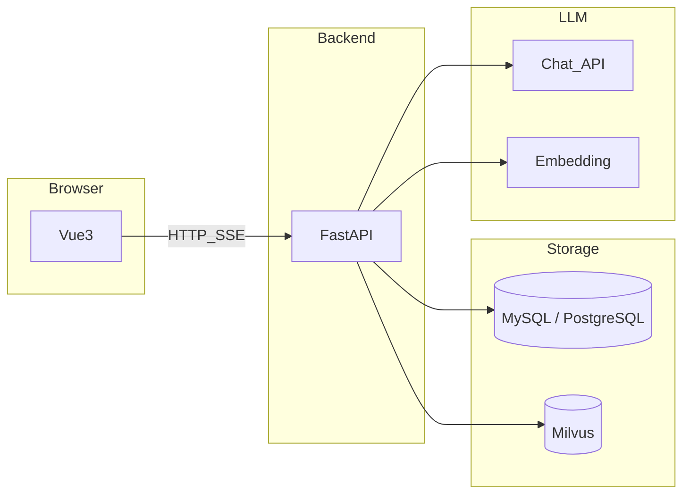

# KB-Copilot / 知识库 Copilot

[](LICENSE)
[](https://www.python.org/downloads/)
[](https://github.com/uglyp/KB-Copilot/actions/workflows/ci.yml)

自托管 **multimodal RAG** 知识库与流式对话：**FastAPI** · **Vue 3** · **Milvus**；PDF/文本与图片（**PaddleOCR**，可选）入库，**SSE** 流式回答；对话模型可接 **Ollama**、**DeepSeek** 等 OpenAI 兼容 API。

**English:** Self-hosted **multimodal RAG** with **SSE** chat — **FastAPI**, **Vue 3**, **MySQL** or **PostgreSQL**, **Milvus**; **PDF/text** + **images** (optional **PaddleOCR**); **fastembed** or **OpenAI-compatible** embeddings; chat via **DeepSeek**, **Ollama**, or compatible providers.

**中文：** 以自托管为主，按 [多模态 RAG 路线图](docs/多模态RAG路线图.md) 持续扩展；当前为「知识库侧入库 + 文本向量检索 + 文本对话」闭环，企业级能力见下文「边界」。

## 特性要点

| 维度 | 说明 |
| --- | --- |
| 部署 | 自建数据与向量；默认 **Milvus Lite** 本地 `.db`，亦可下文「Docker 版 Milvus」 |
| RAG | 分块、向量化、召回、拼上下文；前端展示检索阶段（ThoughtChain 等） |
| 多模态 | 图片经 **PaddleOCR** 入文本流水线（`uv sync --extra image`）；见下文「知识库图片」 |
| 模型 | 多提供商与多 chat 模型；**Ollama** 与云端可并存 |

## 技术栈

`FastAPI` · `Vue 3` · `Vite` · `TypeScript` · `MySQL` / `PostgreSQL` · `Alembic` · `Milvus` · `fastembed` / OpenAI-compatible · `SSE` · [vue-element-plus-x](https://element-plus-x.com)

## 目录

- [最短快速开始](#最短快速开始)
- [架构概要](#架构概要)
- [功能状态](#功能状态)
- [适合与当前边界](#适合与当前边界)
- [开源与协作](#开源与协作)
- [详细说明](#详细说明)
  - [后端](#后端backend)
  - [前端](#前端frontend)
  - [向量与知识库（RAG）](#向量与知识库rag)
  - [功能入口](#功能入口)

## 最短快速开始

需要 **[uv](https://docs.astral.sh/uv/)**、**MySQL 或 PostgreSQL**（见 `backend/.env.example`）、**Node.js**。

**终端 1 — 后端**

```bash
git clone https://github.com/uglyp/KB-Copilot.git
cd KB-Copilot/backend
uv sync
cp .env.example .env   # 编辑 DATABASE_URL、FERNET_KEY、JWT_SECRET 等
uv run alembic upgrade head
uv run uvicorn app.main:app --reload --host 0.0.0.0 --port 8000
```

**终端 2 — 前端**

```bash
cd KB-Copilot/frontend
npm install
npm run dev
```

- 前端：<http://localhost:5173>（Vite 将 `/api` 代理到后端）
- 健康检查：<http://127.0.0.1:8000/health> · API 前缀 `/api/v1`

Fork 后请替换 `git clone` 地址。

<!--


-->

## 架构概要



## 功能状态

完整分期:

- **第一期 · 文本向量图像 RAG；**
- **第二期 · CLIP 双通道；**
- **第三期 · Agent / 评测 / 对话 / VLM；**

下表为 **任务列表**。

### 已实现功能

- [x] **账户与安全**：注册/登录、JWT、忘记密码与重置页；令牌 **SHA256** 落库；生产需邮件/短信（开发可用 `.env` 返回 `reset_url`）。
- [x] **知识库与文档**：知识库管理；PDF/纯文本上传、解析、分块、入库；元数据入关系型库（MySQL / PostgreSQL）。
- [x] **双数据库支持**：支持可配置MySQL / PostgreSQL。
- [x] **多模态入库（第一期）**：位图上传 → **PaddleOCR** → 与同文档流水线分块/向量化（`uv sync --extra image`）；`modality` / `extra_json`；Caption 字段预留，**当前以 OCR 为主**。
- [x] **向量与检索**：单一 Milvus **文本向量** collection；**fastembed** 或 OpenAI 兼容 **embedding**；查询为文本向量检索，可按知识库过滤。
- [x] **RAG 对话**：拼上下文；图像块带 **`[图像/OCR]`**；**SSE**；**`citations_json`** 引用。
- [x] **模型与集成**：多提供商；**DeepSeek** / **Ollama**；`.env` 可自动注入 Ollama；对话页切换模型（本地存储）。
- [x] **前端**：会话列表、流式回答、检索进度、知识库与模型设置页。

### 待实现与规划中

- [ ] **第二期 · 双通道检索**：CLIP 图像向量、独立 collection；BGE 文本路 + CLIP 文本塔；**RRF/加权融合**与去重；**`retrieval_channel`** 等归因。
- [ ] **第三期 · Agent 与质量**：规划/多跳、**tools**（如 `search_knowledge`）、长期记忆与摘要、评测集与可选追踪（Langfuse / Phoenix 等）。
- [ ] **对话内传图 · VLM（§6）**：临时图片不入库；多模态 **messages**；与 RAG 同轮组合。
- [ ] **第一期补强**：Caption、异步队列与失败重试、**BGE-M3** 等（**换模型须重建向量**）。
- [ ] **更多模态（§8）**：视频（ASR/关键帧）、复杂 PDF 版式。
- [ ] **企业级**：多租户、权限审计、SSO、配额、可观测性等（见「边界」）。

**分期摘要：** 已勾选项 ≈ 路线图 **第一期**；未勾选项覆盖第二、三期及补强。版本变更见 [`CHANGELOG.md`](CHANGELOG.md)。

## 适合与当前边界

- **适合**：自托管数据、自选模型、按路线图逐步增强的团队与个人。
- **边界**：不承诺 SSO、细粒度审计、配额计费等开箱能力；生产请自行加固密钥、邮件重置、数据库与向量库访问控制。

## 开源与协作

- [贡献指南](CONTRIBUTING.md) · [安全披露](SECURITY.md) · [行为准则](CODE_OF_CONDUCT.md) · [变更记录](CHANGELOG.md)
- [CHANGELOG 自动维护说明](docs/CHANGELOG_AUTOMATION.md) · [GitHub Description / Topics](docs/GITHUB_REPOSITORY_METADATA.md)
- 许可证：[MIT](LICENSE)

---

## 详细说明

以下为安装、配置与进阶选项（与「最短快速开始」互补）。**名词释义**（RAG、Token、Milvus、Chunk 等）：[术语表与概念说明](docs/术语表与概念说明.md)。


### 后端（`backend/`）

依赖以 **`backend/pyproject.toml`** / **`backend/uv.lock`** 为准；**`backend/requirements.txt`** 供 `pip install -r`。更多命令见 **[`backend/README.md`](backend/README.md)**。

1. `cd backend` 后 `uv sync`。
2. 配置 **`backend/.env`**（与 `app/` 同级，路径固定）：
   - `DATABASE_URL`：**MySQL** 用 `mysql+aiomysql://...`；**PostgreSQL** 用 `postgresql+asyncpg://...`。`!`、`@` 等需 URL 编码；`1045` 多为账号与 URL 不一致。可选 `RELATIONAL_DB=mysql` / `postgresql` 与 URL 一致时做校验。
   - `FERNET_KEY`：`uv run python -c "from cryptography.fernet import Fernet; print(Fernet.generate_key().decode())"`
   - `JWT_SECRET`：足够长的随机串。
3. 建库示例：MySQL：`CREATE DATABASE IF NOT EXISTS kb_copilot CHARACTER SET utf8mb4 COLLATE utf8mb4_unicode_ci;`；PostgreSQL：`CREATE DATABASE kb_copilot;`（编码默认 UTF-8）。MySQL 与 PG 二选一即可。
4. `uv run alembic upgrade head`（拉取新迁移后重跑）。
5. `uv run uvicorn app.main:app --reload --host 0.0.0.0 --port 8000`

健康检查：<http://127.0.0.1:8000/health> · API：`/api/v1`

**不使用 uv：** `python -m venv .venv && source .venv/bin/activate`（Windows：`.venv\Scripts\activate`），`pip install -r requirements.txt`，再 `alembic upgrade head` 与 `uvicorn ...`（导入失败可 `export PYTHONPATH=.`）。

#### 忘记密码

- 前端：`/forgot-password`、`/reset-password`。
- `password_reset_tokens` 仅存 token 的 **SHA256**。
- 无邮件时 `.env` 可设 `PASSWORD_RESET_TOKEN_IN_RESPONSE=true`（**仅开发**）；**生产务必 `false`**。

### 前端（`frontend/`）

1. `cd frontend` → `npm install` → `npm run dev`
2. Vite 将 `/api` 代理到 `http://127.0.0.1:8000`；`src/api/http.ts` 默认 `baseURL` `/api/v1`。
3. 静态部署无代理时设置 `VITE_API_BASE`（如 `http://你的后端:8000/api/v1`）。
4. 对话 UI：**[vue-element-plus-x](https://element-plus-x.com)**；SSE：`src/api/sse.ts`；主题：`src/styles/kb-theme.css`。

### 向量与知识库（RAG）

- **本地向量：** `USE_LOCAL_EMBEDDING=true`，**fastembed**（默认 `BAAI/bge-small-zh-v1.5`）；首次从 Hugging Face 拉模型（可配 `HF_ENDPOINT` 镜像）。
- **远程 embedding：** `USE_LOCAL_EMBEDDING=false`，「模型设置」或 `.env` 中 `EMBEDDING_*`（OpenAI 兼容）。
- **对话模型：** `DEEPSEEK_API_KEY` 可在无提供商时自动注入 DeepSeek chat（与向量配置独立）。

#### 知识库图片（OCR 入库，第一期）

- 支持 **PNG / JPG / WebP / GIF / BMP**；**PaddleOCR** 后与 PDF/文本同流水线。
- `uv sync --extra image`；国内可用 PyPI 镜像；详见 [Paddle 安装](https://www.paddlepaddle.org.cn/install/quick)。
- 多模态字段需已执行 `alembic upgrade head`。

#### Ollama 本地对话（Qwen 3B 等）

详见 **[`docs/LOCAL_DEV_AND_OLLAMA.md`](docs/LOCAL_DEV_AND_OLLAMA.md)**。摘要：[Ollama](https://ollama.com) OpenAI 兼容 **chat**；向量仍建议本地 **fastembed**。

1. `ollama pull qwen2.5:3b`（以官方库名为准），`ollama list` 确认。
2. 「模型设置」：Base `http://127.0.0.1:11434`（**勿**带 `/v1`），Key 任意非空，chat 的 `model_id` 与 Ollama 一致。
3. 或 `.env`：`OLLAMA_BASE` + `OLLAMA_CHAT_MODEL`，重启后重新登录。
4. 对话页可切换默认模型与 Ollama。

#### Docker 版 Milvus（可选）

默认 **Milvus Lite** 使用 `MILVUS_DB_PATH=./data/milvus_local.db`（与独立服务数据**不互通**）。需要多实例、控制台或更高吞吐时，可部署独立 Milvus，例如遵循官方文档 [Install Milvus Standalone with Docker](https://milvus.io/docs/install_standalone-docker.md) 使用 `docker compose` 启动后：

- gRPC / SDK 常见端口：`19530`
- `.env`：`MILVUS_URI=http://127.0.0.1:19530`（可选 `MILVUS_TOKEN` 用于鉴权或 Zilliz Cloud）
- 巡检：`cd backend && uv run python scripts/inspect_milvus.py`

**自 Qdrant 迁移：** 需更新环境变量为 `MILVUS_*`，执行 `alembic upgrade head`（列名 `milvus_point_id`），并**重新入库**向量数据。

更换 embedding 维度时请删除旧 Milvus collection、清空本地 `.db` 或改 `MILVUS_COLLECTION` 后全量重建。

### 功能入口

- **对话：** 配置任一 chat 模型（DeepSeek 可自动注入）。
- **知识库问答：** 需 embedding 就绪（本地 fastembed 或远程 API）。
