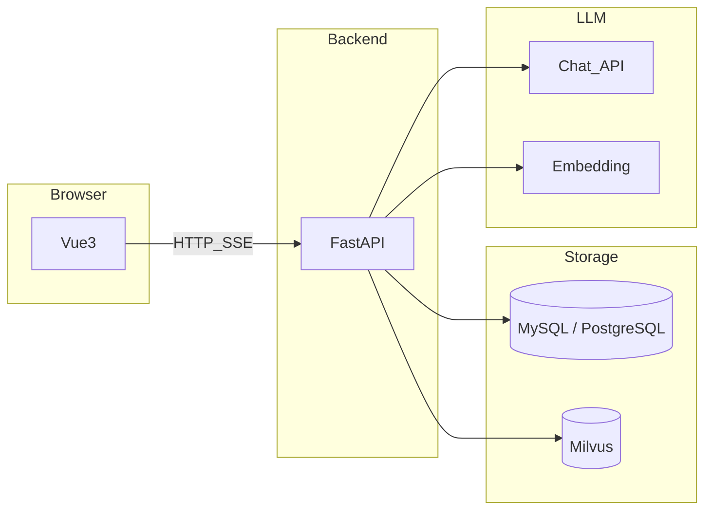

# OrgCopilot（组织知识 Copilot）

[](LICENSE)
[](https://www.python.org/downloads/)
[](https://github.com/uglyp/org-copilot/actions/workflows/ci.yml)

**本项目为学习项目，在不断试错，调优，迭代，终极目标是做出企业级的项目效果**

**OrgCopilot** 是一套可 **自托管** 的 **知识库问答（RAG）** 与 **流式对话** 系统：支持 **PDF / 文本** 与 **图片（OCR）** 入库，**Milvus** 向量检索，**FastAPI** 后端与 **Vue 3** 前端，对话通过 **SSE** 推送；可对接 **Ollama**、**DeepSeek** 等 **OpenAI 兼容** 的对话与向量 API。适用于团队内部文档检索、合规敏感场景下的 **企业级访问控制（ACL）** 原型与扩展。

**检索友好关键词（中文）：** 知识库、RAG、检索增强生成、向量数据库、Milvus、embedding、分块、引用溯源、多模态 OCR、企业权限、分行密级、JWT、FastAPI、Vue3、Vite、TypeScript、自托管、开源 MIT。

**English (short):** Self-hosted **multimodal RAG** knowledge base with **SSE** streaming chat — **FastAPI**, **Vue 3**, **MySQL** or **PostgreSQL**, **Milvus**; **PDF/text** + **images** (optional **PaddleOCR**); **fastembed** or OpenAI-compatible embeddings; chat via **DeepSeek**, **Ollama**, or compatible providers.

---

## 特性概要

| 维度 | 说明 |
| --- | --- |
| 部署 | 数据与向量自建；默认 **Milvus Lite** 本地 `.db`，也可接独立 Milvus 服务 |
| RAG | 分块、向量化、召回、拼上下文；前端可展示检索过程与引用（`citations_json`） |
| 多模态（当前） | 图片经 **PaddleOCR** 进入与文档相同的文本向量流水线（可选依赖 `uv sync --extra image`） |
| 权限 | 默认 **企业 ACL**：Milvus 标量过滤 + RAG 返回前与列表一致的文档校验（可用环境变量关闭） |
| 模型 | 多提供商、多 chat 模型；**Ollama** 与云端可并存 |

## 技术栈

FastAPI · Vue 3 · Vite · TypeScript · MySQL / PostgreSQL · Alembic · Milvus · fastembed / OpenAI 兼容 Embedding · SSE · [vue-element-plus-x](https://element-plus-x.com)

## 目录

- [分期能力：已实现 / 未实现](#分期能力已实现--未实现)
- [最短快速开始](#最短快速开始)
- [架构概要](#架构概要)
- [适合场景与当前边界](#适合场景与当前边界)
- [开源与协作](#开源与协作)
- [详细说明](#详细说明)

---

## 分期能力：已实现 / 未实现

产品与技术规划按 **阶段一～四**（多模态基线 → 企业权限 → 双通道 CLIP → Agent / VLM / 合规）递进；下列 **任务列表** 便于对照仓库现状与路线图。

### 阶段一：多模态知识库 + 文本 RAG 基线

- [x] **账户与安全**：注册 / 登录、JWT；忘记密码与重置页；重置令牌 **SHA256** 落库（生产需邮件链路；开发可用环境变量返回 `reset_url`）。
- [x] **知识库与文档**：知识库创建与管理；PDF / 纯文本上传、解析、分块、入库；元数据在关系型库（MySQL / PostgreSQL）。
- [x] **关系库二选一**：支持 **MySQL** 与 **PostgreSQL**（连接串与迁移一致即可）。
- [x] **图片入库（OCR 路径）**：位图上传 → **PaddleOCR** → 与同文档流水线分块 / 向量化；`modality`、`extra_json` 等字段；Caption 可增强，**当前以 OCR 为主**。
- [x] **向量与检索**：单一 Milvus **文本向量** collection；**fastembed** 或 OpenAI 兼容 **embedding**；按知识库过滤；流式对话中带引用片段。
- [x] **RAG 对话**：拼上下文；图像块可带 **`[图像/OCR]`** 等提示；**SSE**；**`citations_json`**。
- [x] **模型与集成**：多提供商；**DeepSeek** / **Ollama**；环境变量可辅助注入 Ollama；对话页切换模型（前端本地存储）。
- [x] **前端**：会话列表、流式回答、检索进度、知识库（含文档权限元数据与组织共享）、账户与权限、模型与用量等设置页。

### 阶段二：企业权限与安全横切（MVP）

- [x] **用户与文档属性**：文档侧分行、部门、密级、创建者等元数据；用户侧分行、角色、密级上限、部门 JSON、组织 ID 等；与列表 / 下载 / RAG 一致过滤。
- [x] **Milvus 检索期过滤**：向量检索 **expr** 中带权限相关标量，避免「先搜满再过滤」导致召回被掏空（可通过 `ENTERPRISE_ACL_ENABLED` 关闭以兼容旧部署）。
- [x] **返回前二次校验**：RAG 命中的文档再次按 ACL 校验，降低配置错误越权风险。
- [x] **知识库组织共享**：`org_id` + `is_org_shared` 下同组织可见知识库，文档仍受文档级 ACL 约束。
- [x] **系统管理（管理员）**：`role` 为 **admin**（不区分大小写）且账号启用时可维护用户、组织、分行、部门、角色字典、密级展示信息；**ACL 字典只读接口**供注册页等下拉使用。
- [x] **用户启用开关**：`is_active` 停用后无法登录；JWT / `/auth/me` 携带该字段。
- [x] **管理员业务数据权限**：管理员可绕过知识库归属与文档 ACL 做全量数据维护；**对话会话仍按 `user_id` 隔离**（不默认看别人会话）。
- [x] **知识库彻底删除**：级联清理会话、消息、文档、Chunk、Milvus 向量与本地文件（`kb_purge`）。

### 阶段三：双通道检索（CLIP + 文本融合）— 未实现

- [ ] **CLIP 图像向量**：独立 collection；与文本 chunk 主键对齐。
- [ ] **双路检索**：BGE（或当前文本 embedding）一路 + CLIP text tower 一路；**RRF / 加权融合**与按 chunk 去重。
- [ ] **归因字段**：如 **`retrieval_channel`**（`bge` / `clip` 等）便于评测与日志。
- [ ] **送给 LLM 的仍为正则文本**：OCR / Caption 等 **Canonical Text**，不把原图二进制塞给纯文本 chat 模型。

### 阶段四：智能编排、对话看图、图增强、合规运营 — 基本未实现

- [ ] **Agent / 工具编排**：规划、多跳、**`search_knowledge`** 等 tools、与现有检索抽象对接。
- [ ] **长期记忆与摘要**：会话级之上可选用户级记忆、上下文压缩。
- [ ] **评测与可观测**：黄金集、引用命中率、可选 **Langfuse / Phoenix** 等。
- [ ] **对话内临时传图（VLM）**：不入库；多模态 **messages**；与 RAG 同轮组合时需区分引用来源。
- [ ] **图数据库增强检索（可选）**：向量命中后邻接扩展、文档结构工具化；默认关闭、与 Milvus 互补。
- [ ] **合规深化**：检索 / 访问 **审计流水**、配额、SSO、Milvus **分区级物理隔离**、改级审批流等（当前不承诺开箱）。

### 横切补强（跨阶段，部分未做）

- [ ] **Caption 与入库体验**：异步队列、失败重试、更细状态展示（与路线图「第一期风险」一致）。
- [ ] **更强文本向量**：如 **BGE-M3** 等（**换模型须重建向量**）。
- [ ] **视频 / 复杂 PDF 版式** 等更多模态。

**说明：** 上表与仓库内实现、迁移及 `permissions.py`、`rag_chat.py`、`milvus_store.py` 等代码为准；**名词与缩写**见仓库根目录 **[术语表与概念说明.md](术语表与概念说明.md)**。

---

## 最短快速开始

需要 **[uv](https://docs.astral.sh/uv/)**、**MySQL 或 PostgreSQL**（见 `backend/.env.example`）、**Node.js**。

**终端 1 — 后端**

```bash
git clone https://github.com/uglyp/org-copilot.git
cd org-copilot/backend
uv sync
cp .env.example .env   # 编辑 DATABASE_URL、FERNET_KEY、JWT_SECRET 等
uv run alembic upgrade head
uv run uvicorn app.main:app --reload --host 0.0.0.0 --port 8000
```

**终端 2 — 前端**

```bash
cd org-copilot/frontend
npm install
npm run dev
```

- 前端：<http://localhost:5173>（Vite 将 `/api` 代理到后端）
- 健康检查：<http://127.0.0.1:8000/health> · API 前缀 `/api/v1`

Fork 后请替换 `git clone` 地址。

## 架构概要



## 适合场景与当前边界

- **适合**：希望数据与模型自主可控、按阶段扩展多模态与权限的团队与个人；金融 / 政务等 **多分行、多密级** 场景的 **逻辑隔离** 原型。
- **边界**：不承诺开箱 **SSO**、完整 **审计流水**、**配额计费**、**Milvus 分区物理隔离**；生产环境请自行加固密钥、邮件重置、数据库与向量库访问控制。

## 开源与协作

- [贡献指南](CONTRIBUTING.md) · [安全披露](SECURITY.md) · [行为准则](CODE_OF_CONDUCT.md) · [变更记录](CHANGELOG.md)
- 许可证：[MIT](LICENSE)
- **概念与术语**：[术语表与概念说明.md](术语表与概念说明.md)
- **GitHub 仓库名**：**`org-copilot`**（展示名 **OrgCopilot**）。若你曾在本地克隆旧仓库名，请在 GitHub 上将仓库 **Rename** 为 `org-copilot` 后，执行：  
  `git remote set-url origin https://github.com/uglyp/org-copilot.git`

---

## 详细说明

### 后端（`backend/`）

依赖以 **`backend/pyproject.toml`** / **`backend/uv.lock`** 为准；**`backend/requirements.txt`** 供 `pip install -r`。更多命令见 **[`backend/README.md`](backend/README.md)**。

1. `cd backend` 后 `uv sync`。
2. 配置 **`backend/.env`**（与 `app/` 同级）：
   - `DATABASE_URL`：**MySQL** 用 `mysql+aiomysql://...`；**PostgreSQL** 用 `postgresql+asyncpg://...`。特殊字符需 URL 编码。
   - `FERNET_KEY`：`uv run python -c "from cryptography.fernet import Fernet; print(Fernet.generate_key().decode())"`
   - `JWT_SECRET`：足够长的随机串。
3. 建库示例：MySQL：`CREATE DATABASE IF NOT EXISTS org_copilot CHARACTER SET utf8mb4 COLLATE utf8mb4_unicode_ci;`；PostgreSQL：`CREATE DATABASE org_copilot;`（若已有旧库 `kb_copilot`，可在 `DATABASE_URL` 中继续指向旧库名，无需强制迁移。）
4. `uv run alembic upgrade head`（拉取新代码后若有多迁移需重跑）。
5. `uv run uvicorn app.main:app --reload --host 0.0.0.0 --port 8000`

**忘记密码：** 前端 `/forgot-password`、`/reset-password`；生产务必将 `PASSWORD_RESET_TOKEN_IN_RESPONSE` 设为 `false`。

### 前端（`frontend/`）

1. `cd frontend` → `npm install` → `npm run dev`
2. Vite 将 `/api` 代理到 `http://127.0.0.1:8000`；`src/api/http.ts` 默认 `baseURL` `/api/v1`。
3. 静态部署无代理时设置 `VITE_API_BASE`（如 `http://你的后端:8000/api/v1`）。
4. 对话 UI：**vue-element-plus-x**；SSE：`src/api/sse.ts`；主题：`src/styles/kb-theme.css`。

### 向量与知识库（RAG）

- **本地向量：** `USE_LOCAL_EMBEDDING=true`，**fastembed**（默认 `BAAI/bge-small-zh-v1.5`）；首次可能从 Hugging Face 拉模型（可配 `HF_ENDPOINT` 镜像）。
- **远程 embedding：** `USE_LOCAL_EMBEDDING=false`，在「模型设置」或 `.env` 中配置 `EMBEDDING_*`（OpenAI 兼容）。
- **对话模型：** `DEEPSEEK_API_KEY` 等按提供商配置；可与向量配置独立。

**知识库图片（OCR）：** 支持 **PNG / JPG / WebP / GIF / BMP**；执行 `uv sync --extra image` 安装 Paddle 相关依赖；国内可参考 [Paddle 安装](https://www.paddlepaddle.org.cn/install/quick)。

**Ollama 本地对话（简述）：**

1. 安装 [Ollama](https://ollama.com)，`ollama pull` 所需 chat 模型。
2. 「模型设置」：Base URL 填 `http://127.0.0.1:11434`（**不要**带 `/v1`），API Key 填任意非空字符串，模型名与 `ollama list` 一致。
3. 或 `.env` 配置 `OLLAMA_BASE`、`OLLAMA_CHAT_MODEL` 后重启后端。
4. 向量侧仍推荐使用本地 **fastembed** 或独立 embedding 服务，与 Ollama 解耦。

**Docker 版 Milvus（可选）：** 默认 **Milvus Lite** 使用 `MILVUS_DB_PATH=./data/milvus_local.db`，与独立服务数据**不互通**。独立部署可参考 [Milvus Standalone Docker](https://milvus.io/docs/install_standalone-docker.md)，`.env` 设置 `MILVUS_URI=http://127.0.0.1:19530`（可选 `MILVUS_TOKEN`）。更换 embedding 维度或 collection 名后需按文档重建向量。

### 功能入口

- **对话：** 配置任一 chat 模型后即可使用。
- **知识库问答：** 需 embedding 就绪（本地或远程）。
